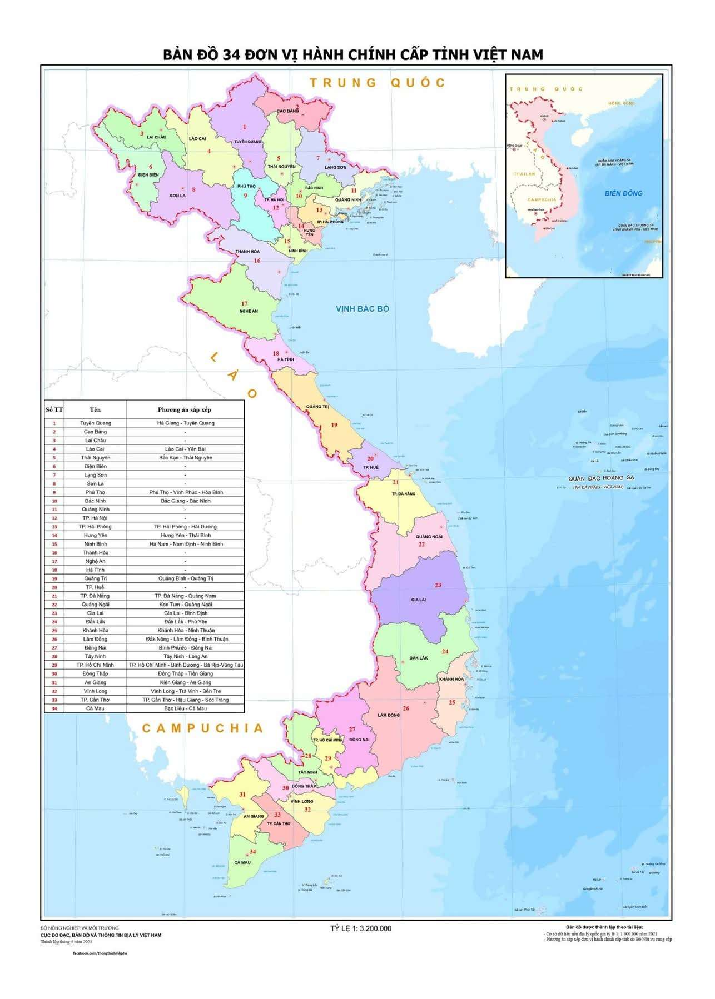
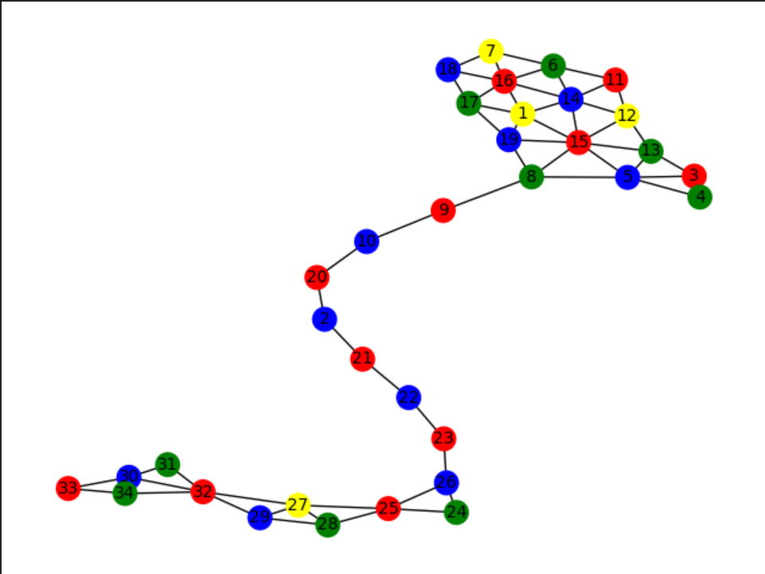

# VietNam Map Coloring
> **Can 34 Vietnamese provinces be colored using only three colors?**




## Process Research
**Read detail in `Report` folder**

We treat each province as a node. The edges represent provinces that are adjacent to each node.
We observe the map and record the nodes and edges in `map.csv`.

Using `map.csv`, we write a Constraint Satisfaction Problem in MiniZinc, a tool that supports finding solutions to CSPs.
This process is implemented in `VnColoring.mzn`.

We then import the solution into `mapVN.py` and visualize the coloring with `Matplotlib`, using `NetworkX` to store the nodes and relationships. 

```python
py mapVN.py
```
**Remember to install the essential libraries.**

